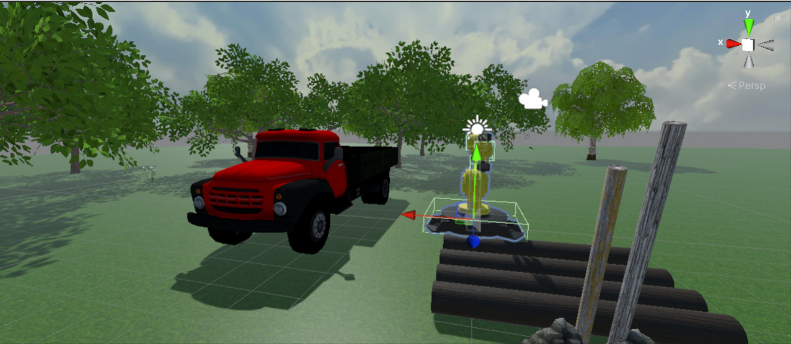
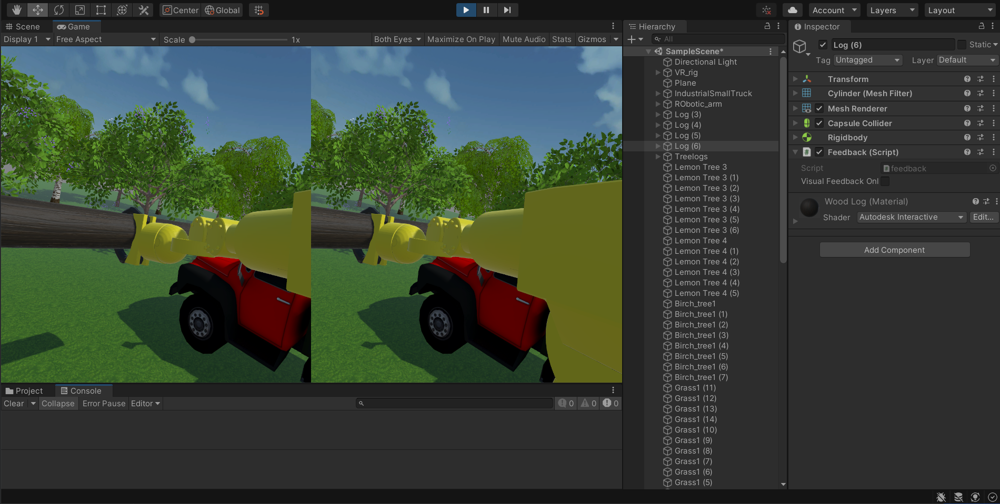

# VR-Truck-Simulator

## Introduction
In this project a crane VR simulator to load logs into a truck was developed based on Unity and the Oculus Quest 2. The main objective of the simulator is to load the logs into the truck without hitting the truck. Thus, an Haptic feedback was provided to the player through the vibration of the controllers, the vibration intensity is stronger is the log is near or touching the truck meanwhile it is weaker if the log is far from the truck.

## Requirements
- XR Interaction Toolkit
- XR Plug-in Management
- Robotic Industrial Dynamic Arm
- Treelogs
- Numena
- IndustrialSmallTruck
 

## Results
